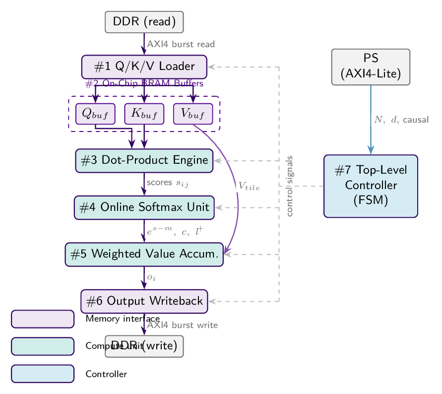

# FlashAttention Accelerator on PYNQ-Z2

**Team:** Anuj Apte · Ricardo Díaz · Raquel Brown — NYU Spring 2026  
**Board:** PYNQ-Z2 (Zynq XC7Z020-CLG400-1) · **Toolchain:** Vitis HLS 2023.2

## What it computes

Single-head scaled dot-product attention forward pass using a tiled online-softmax algorithm (FlashAttention style):

```
O = softmax(Q K^T / sqrt(d)) V
```

Q, K, V, O ∈ ℝ^(N×d), with optional causal masking. Inputs are read from DDR via four independent AXI4 Master channels; parameters (N, d, causal, base addresses) are written by the PS over AXI4-Lite. All intermediate state (scores, running max m, normalization l, accumulator) lives on-chip — peak memory traffic is O(N·d) instead of O(N²).

Compile-time limits: N ≤ 64, d ≤ 32, tile sizes BQ = BK = 8.

## Architecture



Seven sub-modules process Q/K/V tiles through a sequential pipeline: the Loader (blue) fetches tiles from DDR into on-chip BRAM buffers; the Dot-Product Engine (green) computes scaled scores; the Online Softmax Unit tracks running max and normalization; the Weighted Value Accumulator maintains a normalized running output; and the Writeback module sends the result back to DDR. The PS configures all parameters over AXI4-Lite; a top-level FSM coordinates the tile loops.

## Repository layout

```
code/
  flash_attention.cpp          # HLS kernel (DUT)
  tb_flash_attention.cpp       # C++ testbench
  golden_model.py              # Python float64 reference + test vector generator
  run_hls.tcl                  # Vitis HLS automation script
  test_outputs/
    tv_attention_python.csv    # golden-model test vectors (input to testbench)
    tv_attention_csim.csv      # C-simulation results
    tv_attention_rtl.csv       # RTL co-simulation results
  doc/reports/
    flash_attention_hls_csynth.rpt   # full synthesis report
    csynth_design_size.rpt           # resource summary
    flash_attention_hls_Pipeline_*   # per-pipeline loop reports
doc/
  presentation.tex / .pdf      # slide deck
  diagram_standalone.tex       # standalone TikZ block diagram source
  architecture.png             # block diagram exported for README
detailed_plan.md               # full design document (IP spec, arch, evaluation)
```

## How to reproduce

**Step 1 — generate test vectors**

```bash
cd code
python golden_model.py
# writes code/test_outputs/tv_attention_python.csv
```

**Step 2 — run Vitis HLS (C-sim → synthesis → RTL co-sim → IP export)**

```bash
vitis_hls -f code/run_hls.tcl
```

This runs all four stages in sequence. Expected outputs:

| Stage | Output file |
|-------|-------------|
| C-simulation | `code/test_outputs/tv_attention_csim.csv` |
| Synthesis report | `doc/reports/flash_attention_hls_csynth.rpt` |
| RTL co-simulation | `code/test_outputs/tv_attention_rtl.csv` |

To run only selected stages, comment out lines in `run_hls.tcl` (each stage is one call: `csim_design`, `csynth_design`, `cosim_design`, `export_design`).

## Results

### Functional verification

5 test vectors covering single-tile (N=4, 8) and multi-tile (N=16, 2×2 tiles) paths, both non-causal and causal. Tolerance = 1×10⁻⁴.

| Test | N  | d | Causal | Max \|err\| vs float64 | C-sim | RTL co-sim |
|------|----|---|--------|------------------------|-------|------------|
| 0    | 4  | 4 | No     | 6.0×10⁻⁸               | PASS  | PASS       |
| 1    | 4  | 4 | Yes    | 1.2×10⁻⁷               | PASS  | PASS       |
| 2    | 8  | 4 | Yes    | 1.2×10⁻⁷               | PASS  | PASS       |
| 3    | 16 | 8 | No     | 1.2×10⁻⁷               | PASS  | PASS       |
| 4    | 16 | 8 | Yes    | 1.6×10⁻⁷               | PASS  | PASS       |

**5/5 pass.** Maximum error 1.6×10⁻⁷ — more than 600× below tolerance, consistent with expected float32 rounding.

### Synthesis (target: xc7z020-clg400-1, 100 MHz)

**BRAM_18K 141/280 (50%) · DSP48E1 178/220 (81%) · FF 31,527/106,400 (30%) · LUT 40,259/53,200 (76%).** All resources fit within the PYNQ-Z2 budget. Timing slack −1.40 ns at 100 MHz; functional at ≈ 87 MHz. All inner loops achieve II = 1.

| Resource   | Used    | Available | Utilization | Goal  |
|------------|---------|-----------|-------------|-------|
| BRAM_18K   | 141     | 280       | 50%         | ≤ 70% |
| DSP48E1    | 178     | 220       | 81%         | ≤ 90% |
| Flip-Flops | 31,527  | 106,400   | 30%         | —     |
| LUTs       | 40,259  | 53,200    | 76%         | ≤ 85% |

**Clock / timing:** Target 10 ns (100 MHz). Timing slack −1.40 ns — design meets timing at ≈ 87 MHz. Critical path is the FIND_MAX comparator chain; a registered reduction tree would close timing at 100 MHz.

**Pipeline II:** All inner loops achieve II = 1 (LOAD_Q, LOAD_KV, SCORE_LOOP, FIND_MAX, UPDATE_ACC, STORE_O). SCORE_LOOP latency 202 cycles with 32 fully-unrolled MACs.

The binding constraint is DSPs (81%), driven by the 32 parallel floating-point multipliers in the dot-product engine. Switching to `ap_fixed<16,6>` would substantially reduce DSP count and is the primary next step.

## Full documentation

See [`detailed_plan.md`](detailed_plan.md) for the complete design document: IP spec, AXI register map, sub-module descriptions, HLS pragma rationale, and synthesis discussion.
